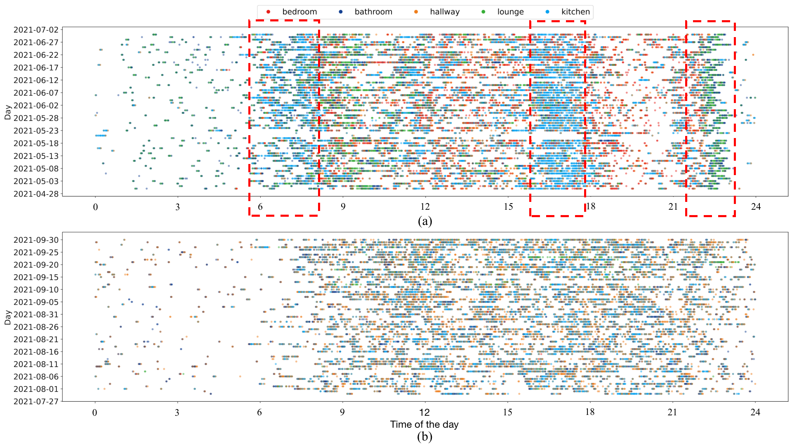
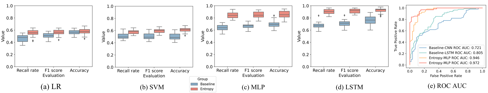

# Minder
This repository includes the code for the Minder Dataset.

## Raw Data
The Minder dataset is not public.
To apply and download the dataset, please contact with [Prof. Payam Barnaghi](mailto:p.barnaghi@imperial.ac.uk).

## Visualisation of the pre-processed data

 

## Feature generation and selection

Generate entropy features, shown as `EntropyFeatures`.

Entropy features for the Minder dataset includes: 
Entropy of Markov chains: `./Modelling/activity_daytime_per_week_mk_entropy.ipynb`, `./Modelling/activity_night_per_week_mk_entropy.ipynb`  

Entropy rate of Markov chains: `./Modelling/activity_daytime_per_week_mk_entropy_rate.ipynb`, `./Modelling/activity_night_per_week_mk_entropy_rate.ipynb`  

Entropy production of Markov chains: `./Modelling/activity_daytime_per_week_mk_entropy_production.ipynb`, `./Modelling/activity_night_per_week_mk_entropy_production.ipynb`  

Von Neumann Entropy of Markov chains (activity frequency): `./Modelling/activity_daytime_per_week_mk_vn_entropy_frequency.ipynb`, `./Modelling/activity_night_per_week_mk_vn_entropy_frequency.ipynb`  

Von Neumann Entropy of Markov chains (activity duration): `./Modelling/activity_daytime_per_week_mk_vn_entropy_duration.ipynb`, `./Modelling/activity_night_per_week_mk_vn_entropy_duration.ipynb` 

The baseline features: `./Modelling/activity_daytime_night_per_week_frequency.ipynb`

## Modelling and results

The evaluation results are:

