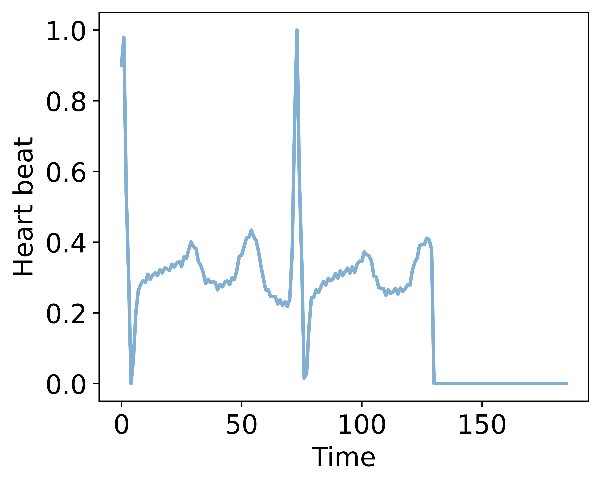
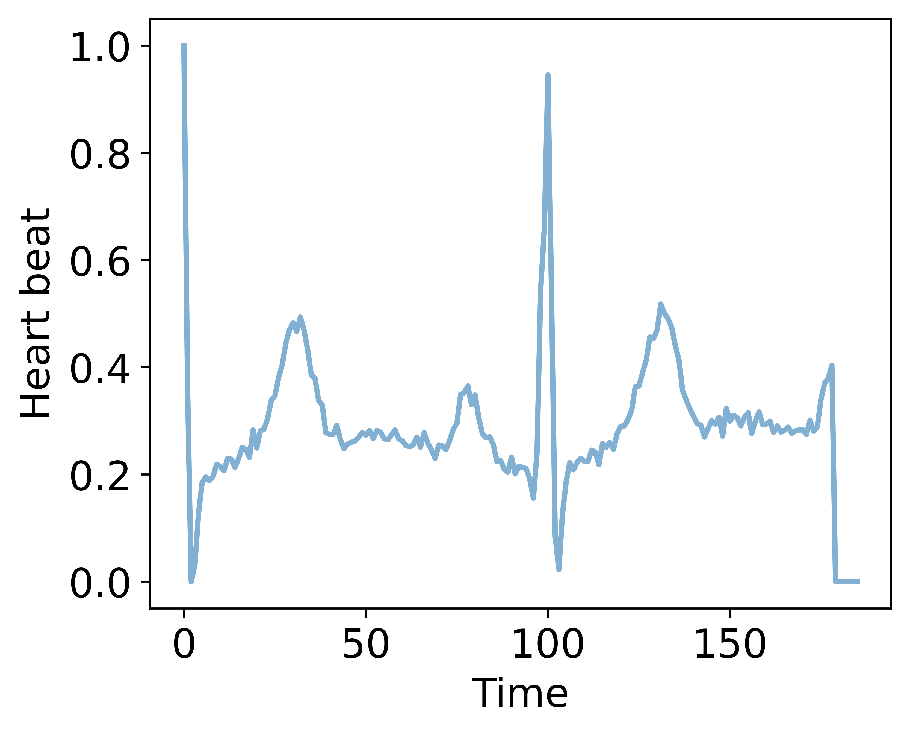
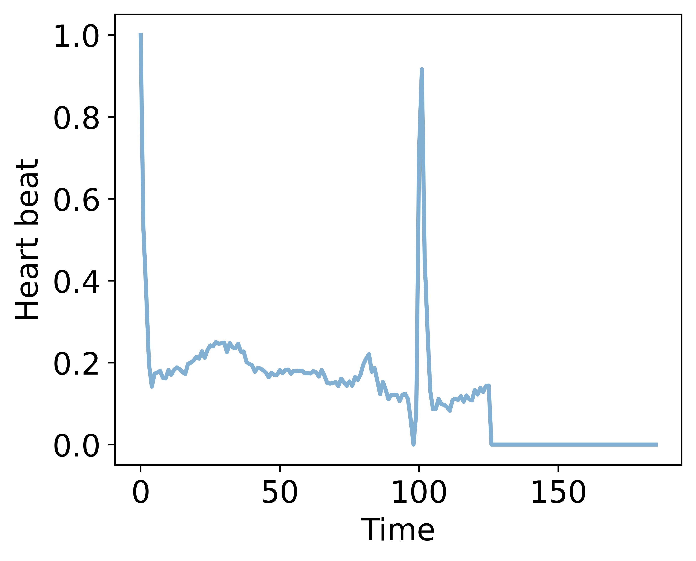
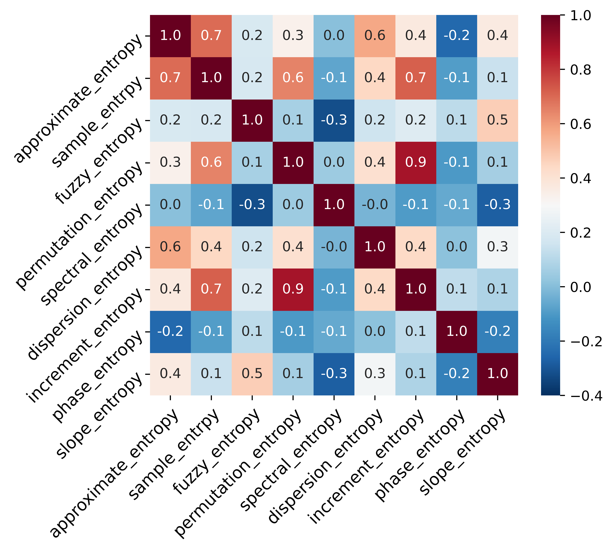
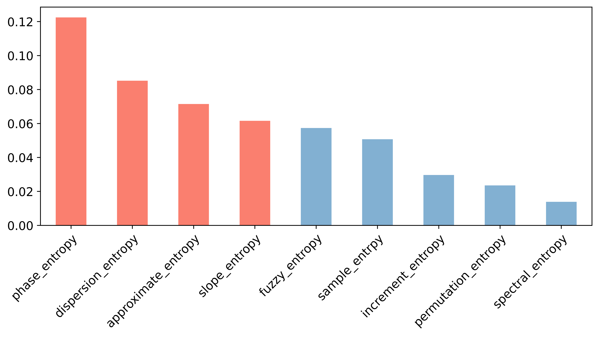

# Gait in Aging and Disease Dataset (GADD)
This repository includes the code for Gait in Aging and Disease Dataset (GADD).

## Raw Data
Download the [orginal data](https://www.physionet.org/content/ptbdb/1.0.0/)[1]. 

Download the [pre-processed data](https://www.kaggle.com/datasets/shayanfazeli/heartbeat).

## Visualisation of the pre-processed data
For the normal participants:

 

For the abnormal participants:

 

The code is in `generate_entropy.ipynb`.

## Feature generation and selection
Generate baseline features and entropy features, shown as `generate_entropy.ipynb`.

Select entropy features by Pearson relationship matrix and mutual information.

<figure>
    
    <figcaption>Pearson relationship matrix<figcaption>
<figure>

<figure>
    
    <figcaption>Mutual information<figcaption>
<figure>

<!--  

 -->

## Modelling and results
### Logistic regression (LR)
The code is shown in `model_lr_baseline.ipynb` and `model_lr_entropy.ipynb`.

The evaluation results are:

### Support vector machine (SVM)
The code is shown in `model_svm_baseline.ipynb` and `model_svm_entropy.ipynb`.

The evaluation results are:

### Multilayer perceptron (MLP)
The code is shown in `network_pytorch`.

The evaluation results are:

[1]Goldberger, A., Amaral, L., Glass, L., Hausdorff, J., Ivanov, P. C., Mark, R., ... & Stanley, H. E. (2000). PhysioBank, PhysioToolkit, and PhysioNet: Components of a new research resource for complex physiologic signals. Circulation [Online]. 101 (23), pp. e215 - e220.