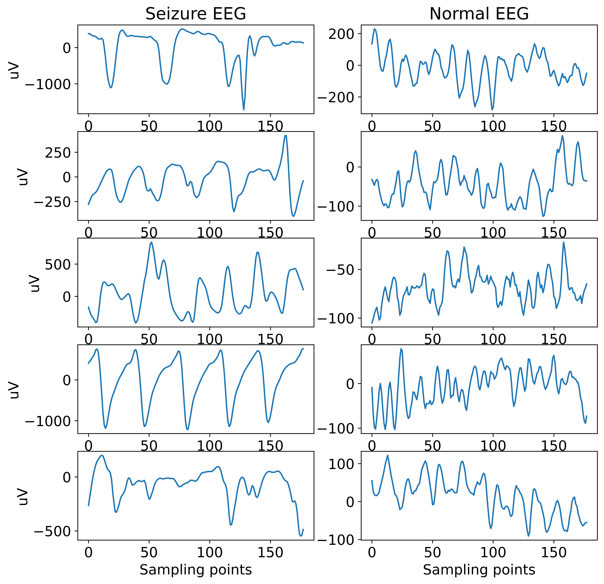
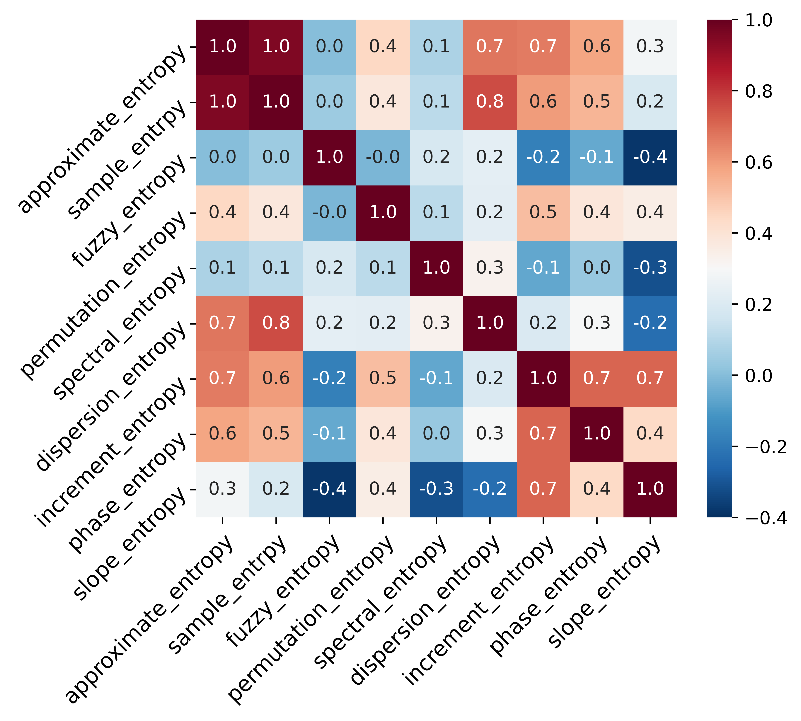
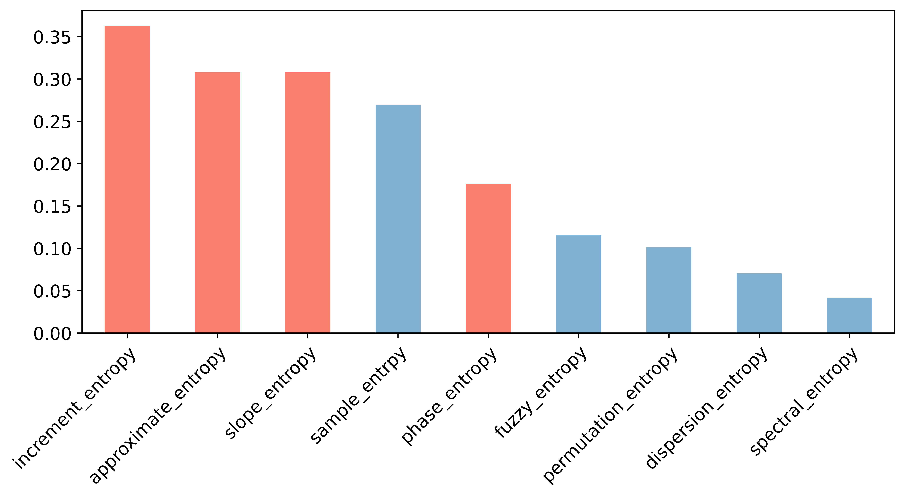
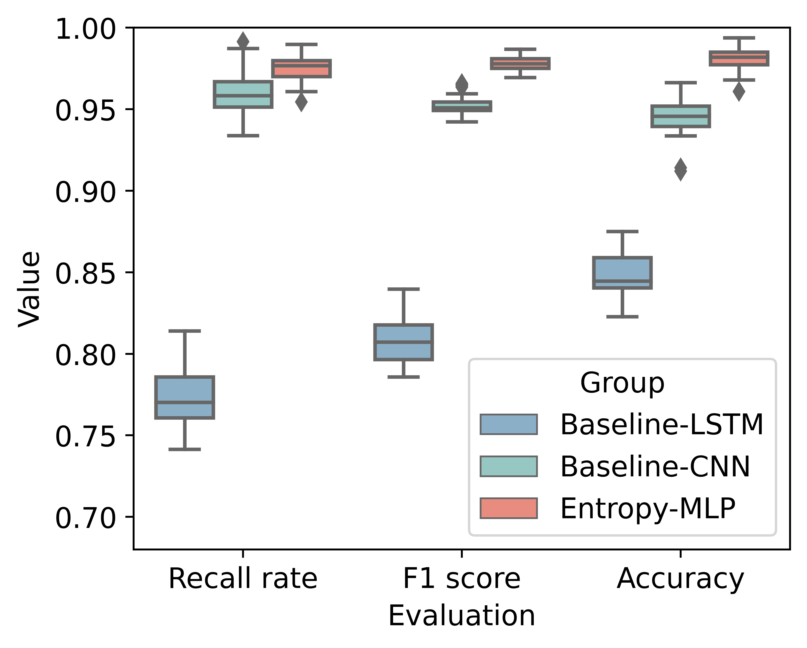
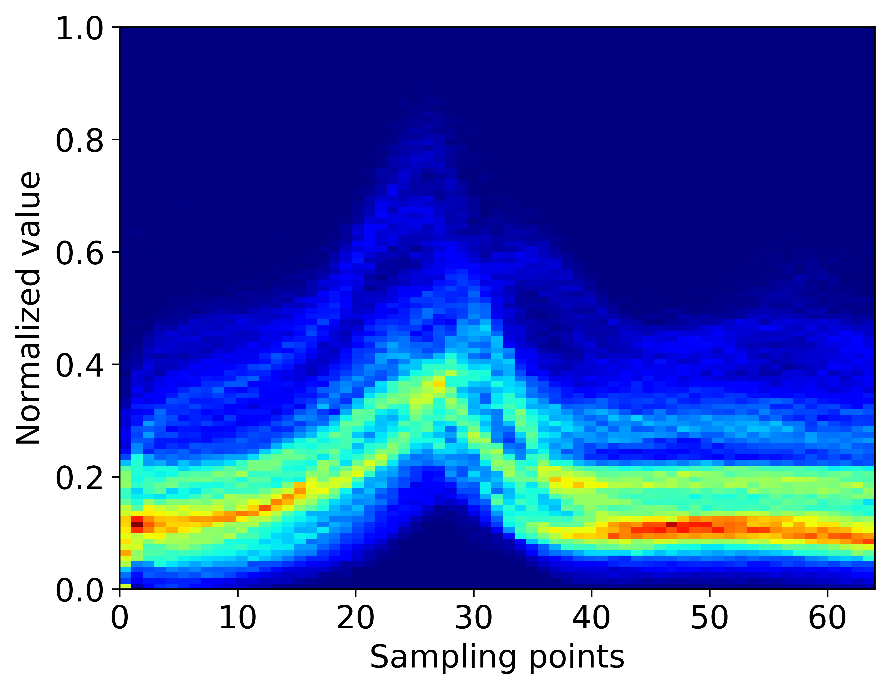
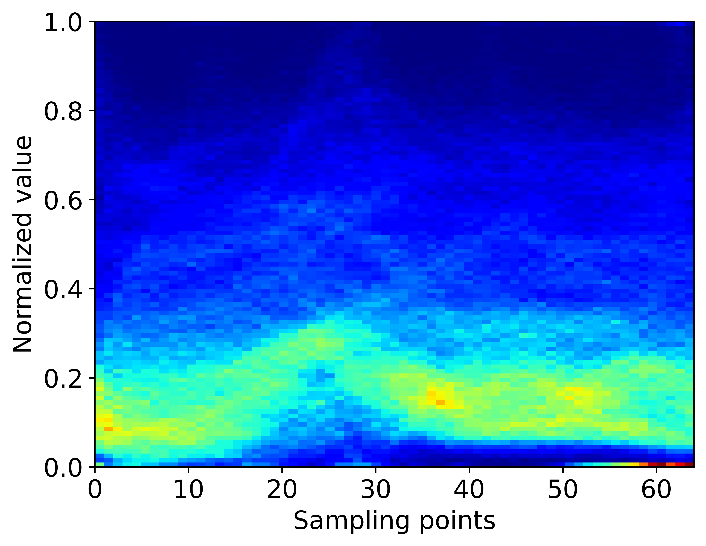
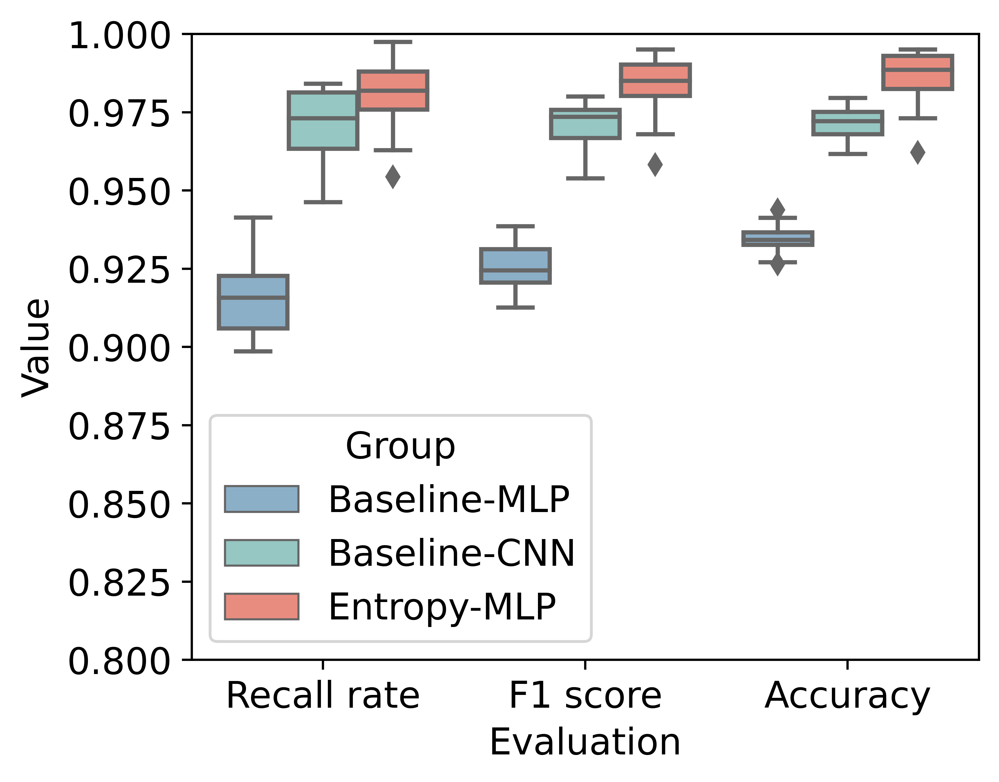

# Information Theory Inspired Pattern Analysis for Time-series Data
This repository includes the code required to reproduce the experiments and figures in the pre-print paper "Information Theory Inspired Pattern Analysis for Time-series Data".
## 1. Requirements
This directory contains the code required to run the experiments to produce the results presented in the paper "Information Theory Inspired Pattern Analysis for Time-series Data"

To get started and download all dependencies, run:

```
pip install -r requirements.txt 
```
## 2. Minder dataset
See `Minder`.

## 3. Epileptic Seizure Recognition Dataset (ESRD)
This repository includes the code for Epileptic Seizure Recognition Dataset (ESRD).

### 3.1 Raw Data
Download the [orginal data](https://archive.ics.uci.edu/ml/datasets/Epileptic+Seizure+Recognition)[1]. 

### 3.2 Visualisation of the pre-processed data

 

The code is in `./ESRD/plot_raw.ipynb`.

### 3.3 Feature generation and selection
Generate entropy features, shown as `./ESRD/generate_entropy.ipynb`.

Select entropy features by Pearson relationship matrix and mutual information.

  

### 3.4 Modelling and results
#### (1) Baseline-CNN
The code is shown in `./ESRD/model_baseline_CNN.ipynb`.

#### (2) Baseline-LSTM
The code is shown in `./ESRD/model_baseline_LSTM.ipynb`.

#### (3) Entropy-MLP
The code is shown in `./ESRD/network_pytorch`.

The evaluation results are:




[1]Andrzejak, R.G., Lehnertz, K., Mormann, F., Rieke, C., David, P. and Elger, C.E., 2001. Indications of nonlinear deterministic and finite-dimensional structures in time series of brain electrical activity: Dependence on recording region and brain state. Physical Review E, 64(6), p.061907.

## 4. PTB Diagnostic ECG Database (PTBDB)
This repository includes the code for PTB Diagnostic ECG Database.

### 4.1 Raw Data
Download the [orginal data](https://www.physionet.org/content/ptbdb/1.0.0/)[2]. 

Download the [pre-processed data](https://www.kaggle.com/datasets/shayanfazeli/heartbeat).

Here we utilize the pre-processed data.

### 4.2 Visualisation of the pre-processed data
For the normal participants:

 

For the abnormal participants:



The code is in `./PTBDB/generate_entropy.ipynb`.

### 4.3 Feature generation and selection
Generate entropy features, shown as `./PTBDB/generate_entropy.ipynb`.

Select entropy features by Pearson relationship matrix and mutual information.

  

### 4.4 Modelling and results
####  (1) Baseline-CNN
The code is shown in `./PTBDB/model_baseline_CNN.ipynb`.

####  (2) Baseline-MLP
The code is shown in `./PTBDB/model_baseline_MLP.ipynb`.

####  (3) Entropy-MLP
The code is shown in `./PTBDB/network_pytorch`.

The evaluation results are:



The code is shown in `./PTBDB/plot_result.ipynb`.

[1]Andrzejak, R.G., Lehnertz, K., Mormann, F., Rieke, C., David, P. and Elger, C.E., 2001. Indications of nonlinear deterministic and finite-dimensional structures in time series of brain electrical activity: Dependence on recording region and brain state. Physical Review E, 64(6), p.061907.


[2]Goldberger, A., Amaral, L., Glass, L., Hausdorff, J., Ivanov, P. C., Mark, R., ... & Stanley, H. E. (2000). PhysioBank, PhysioToolkit, and PhysioNet: Components of a new research resource for complex physiologic signals. Circulation [Online]. 101 (23), pp. e215 - e220.
